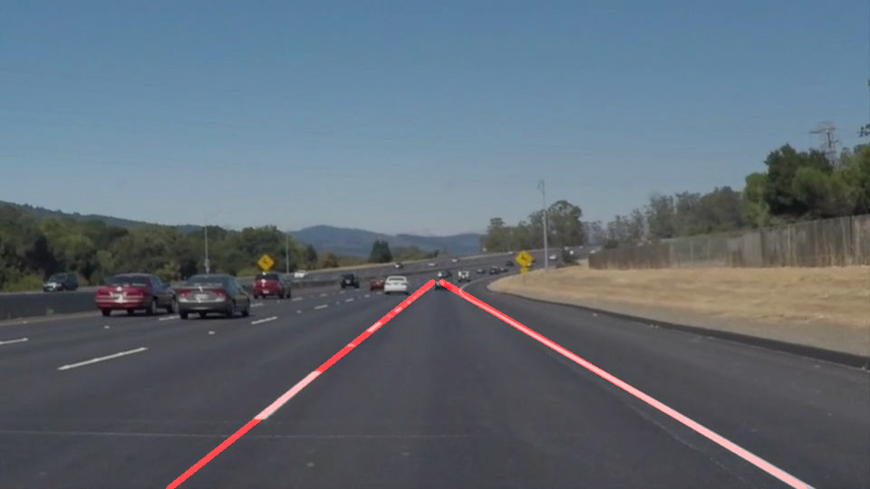

# **Finding Lane Lines on the Road** 

## Writeup Template

### You can use this file as a template for your writeup if you want to submit it as a markdown file. But feel free to use some other method and submit a pdf if you prefer.

---

**Finding Lane Lines on the Road**

The goals / steps of this project are the following:
* Make a pipeline that finds lane lines on the road
* Reflect on your work in a written report

[//]: # (Image References)
 

---

### Reflection

### 1. Describe your pipeline. As part of the description, explain how you modified the draw_lines() function.

The pipeline consists of following steps:
1) grayscaling of image
   (Color_BGR2HSV is used as described on comment of graysacale)
2) application of blur filter

3) usage of canny transformation in order to detect the edges (threshold 50/150)

4) mask for interested region

5) hough transformation for detected edges

6) extraction of lanes (method draw_extracted_lines)
    - two lanes are requested -> left and right lane
    - if detected line is part of left or right lane is chosen depending on slope
    - in case several lines are detected, mean value for intercept b und slope m is used
    - b and m are used to calculate the x1/x2 and y1/y2 coordinates of left and right lane
    - y1 is on the bottom edge of image
    - y2 is the top value of all detected lines (maximal value is the crossing point between left and right lane)
    - x1 and x2 can be calculated with y1,y2 and b,m
 
 7) resulting extracted lane is plotted in the original image 

Result:
Lane lines are detected on each image:

 

 

 

 

 

### 2. Identify potential shortcomings with your current pipeline

- assumption vehicle is always in the middle of the two lanes
- constant values for parameterization of region mask
- constant values for parameterization of canny edge detection
- constant values for parameterization of hough transformation
- description of lanes with stright lanes is not possible in curves
- extracted lanes are not stored form picture to picture

### 3. Suggest possible improvements to your pipeline

- determination of vehicle position and position of lanes in last frame in order to place region mask
- adaptive parameterization of canny edge detection and hough transformation depending on circumstance as illumination, lane color,....
- description of lanes as curvatures
- storage of lane position between frames in case of no detectable lanes in some frames
